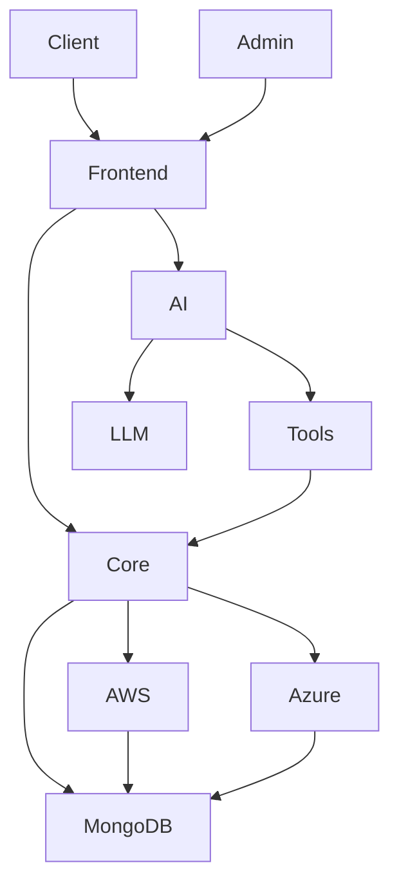

# CloudSync

CloudSync is a functional proof-of-concept for an intelligent multi-cloud orchestration platform. It simulates two cloud providers, AWS and Azure, and includes a deterministic decision engine, provider monitoring, manual/automatic routing, structured logging, and a fully implemented Agentic AI service.

## Project objective

CloudSync demonstrates how a workload can be evaluated against multiple cloud providers using only the customer-selected criteria, then routed to the best provider and monitored for changes. When provider conditions degrade, the system re-evaluates and can shift traffic to an alternative provider.

The platform intentionally does not connect to real cloud providers. Instead, it uses mock providers that expose a normalized API surface and simulate realistic metrics.

## Architecture overview



## High-level system flow

1. Client or admin logs in to the frontend.
2. The frontend calls the CloudSync Core API.
3. Core reads provider metadata and metrics from AWS and Azure mock provider services.
4. The deterministic decision engine evaluates workloads against active constraints.
5. Automatic or manual routing is stored and enforced.
6. Monitoring periodically re-checks providers and re-evaluates automatically when conditions change.
7. The Agentic AI service can inspect state through controlled tools and support natural-language orchestration queries.

## Components

### Frontend
- React + Vite single-page application
- Client and admin dashboards
- Login, registration, and role-based UI
- AI chatbot panel
- Monitoring charts and provider cards

### CloudSync Core Server
- Express.js API server
- JWT auth and role-based access control
- Provider abstraction layer
- Decision engine
- Routing controller
- Monitoring service
- Structured logging
- Manual and automatic mode logic

### Mock Providers
- AWS Mock Provider
- Azure Mock Provider
- Provider-specific metric simulation
- Exposed provider API
- Service catalog and workload endpoints

### Agentic AI Service
- Python + FastAPI service
- Controlled tool layer over Core APIs
- LLM abstraction with environment-based config
- Role-aware actions and confirmation workflow

## Folder structure

```text
CloudSync/
├─ README.md
├─ .gitignore
├─ frontend/
│  ├─ package.json
│  ├─ .env.example
│  ├─ src/
│  └─ public/
├─ core-server/
│  ├─ package.json
│  ├─ .env.example
│  └─ src/
├─ mock-aws/
│  ├─ package.json
│  ├─ .env.example
│  └─ src/
├─ mock-azure/
│  ├─ package.json
│  ├─ .env.example
│  └─ src/
├─ future-agent/
│  ├─ README.md
│  ├─ requirements.txt
│  ├─ .env.example
│  └─ app/
└─ .
```

## Tech stack

- Frontend: React, Vite, React Router, Axios
- Core Server: Node.js, Express, MongoDB, Mongoose, JWT, Axios, CORS
- Providers: Node.js, Express, in-memory state, optional MongoDB
- Agentic AI: Python, FastAPI, Pydantic, httpx, LangChain-compatible design, configurable LLM provider

## Provider abstraction and simulation

The core server does not embed provider-specific logic. Instead, it pulls provider information from a normalized provider API and converts it into a common internal representation. This design allows future support for real AWS, Azure, or GCP providers without rewriting the decision engine or routing code.

Each mock provider exposes a logical service catalog, metrics, health status, and workload endpoints. CloudSync compares equivalent services such as:

- AWS-Compute / Azure-Compute
- AWS-Storage / Azure-Storage
- AWS-Database / Azure-Database

## Decision engine

The core server keeps the decision engine deterministic and explainable. It:

1. Retrieves provider data.
2. Filters out providers that violate hard constraints.
3. Normalizes metrics.
4. Applies weighted priorities selected by the user.
5. Produces a recommendable provider/service pairing.
6. Stores the decision and reasoning for auditing.

The deterministic engine is not replaced by AI. AI may explain the decision using real data, but it cannot fabricate or override it.

## Monitoring and re-evaluation

The monitoring loop periodically collects provider metrics and compares them against the current decision. If a provider degrades beyond acceptable thresholds or another provider becomes more suitable, the system re-evaluates and changes routing. This is logged as a routing change and can be shown in the UI and explained by the AI.

## Manual mode and automatic mode

- Automatic mode: CloudSync evaluates the best provider automatically.
- Manual mode: A user or admin can select a provider/service override.
- Manual selections take precedence until switched back to automatic mode.

## Logging

CloudSync stores structured logs in MongoDB when available, with an in-memory fallback for local demos. Logs include request events, decisions, routing changes, provider failures, provider recoveries, AI interactions, and admin actions.

## Agentic AI architecture

The AI service sits in front of the core and uses only approved tools. It cannot directly access MongoDB or provider admin APIs. It can only call Core APIs. This ensures a safe, auditable, role-aware AI layer.

### AI tool categories

Read-only tools:
- get_provider_metrics
- get_provider_health
- get_all_providers
- compare_providers
- get_current_routing
- get_recent_errors
- get_recent_logs
- get_decision_history
- get_workload_details
- get_monitoring_history
- get_system_status
- get_available_services

Action tools:
- request_provider_switch
- request_manual_routing
- request_automatic_routing

Some actions require confirmation before the tool is executed.

## LLM configuration

The AI service is designed around environment variables so the provider can be changed later without changing the application code.

Example environment keys:

- LLM_PROVIDER
- LLM_API_KEY
- LLM_MODEL
- LLM_BASE_URL
- AI_MAX_TOKENS
- AI_TEMPERATURE

The code uses an abstracted LLM service layer so future integrations for OpenAI, Mistral, Gemini, Anthropic, Groq, OpenRouter, or local models can be supported with minimal changes.

## Security model

- JWT authentication and role-based authorization
- Admin-only operations protected on the Core server
- AI requests include the authenticated user token context
- AI cannot directly bypass Core validation
- Secrets are stored only in environment variables
- No raw credentials are stored in logs

## Environment setup

Each service includes an `.env.example` file. Copy it to `.env` and update the values before running the project.

## Running the services

### Terminal 1: mock AWS
```bash
cd mock-aws
npm install
npm run dev
```

### Terminal 2: mock Azure
```bash
cd mock-azure
npm install
npm run dev
```

### Terminal 3: core server
```bash
cd core-server
npm install
npm run dev
```

### Terminal 4: AI service
```bash
cd future-agent
python -m venv .venv
source .venv/bin/activate
pip install -r requirements.txt
uvicorn app.main:app --reload --port 8000
```

### Terminal 5: frontend
```bash
cd frontend
npm install
npm run dev
```

## API overview

### Core server endpoints
- POST /api/auth/register
- POST /api/auth/login
- GET /api/auth/me
- GET /api/providers
- GET /api/providers/:provider
- GET /api/providers/:provider/services
- GET /api/providers/:provider/metrics
- POST /api/workloads
- GET /api/workloads
- POST /api/decisions/evaluate
- GET /api/decisions/history
- GET /api/routing/current
- POST /api/routing/manual
- POST /api/routing/automatic
- GET /api/logs
- GET /api/logs/errors
- GET /api/admin/dashboard

### Provider endpoints
- GET /api/provider
- GET /api/services
- GET /api/services/:category
- GET /api/metrics
- GET /api/health
- PATCH /api/admin/metrics
- POST /api/admin/simulate-failure
- POST /api/admin/reset

### Agentic AI endpoints
- GET /api/health
- GET /api/tools
- POST /api/chat

## Future integration roadmap

The architecture is designed to expand with future providers and capabilities.

### Future real cloud providers
- Add a provider adapter for real AWS or Azure APIs.
- Implement normalized translation logic.
- Register it in the core configuration.

### Future GCP integration
- Create a GCP provider service with the same common schema.
- Add the provider adapter to the decision engine registry.
- Reuse the same monitoring and routing code.

### Future AI features
- cost forecasting
- carbon forecasting
- capacity prediction
- anomaly detection
- stronger tool orchestration and safer approval workflows

## Demo scenario

The application supports a simple demonstration flow:

1. Log in as a client.
2. Create a compute workload.
3. Allow automatic selection.
4. Observe AWS being selected.
5. Log in as admin and degrade AWS metrics.
6. Observe re-routing to Azure.
7. Ask the AI why the switch happened.
8. Compare providers and investigate health.
9. Ask the AI to switch back to AWS after confirmation.

## Notes

This project is a working initial codebase and demo-oriented implementation. It is intentionally focused on clarity, architecture, and the required flow rather than full production-scale cloud complexity.
